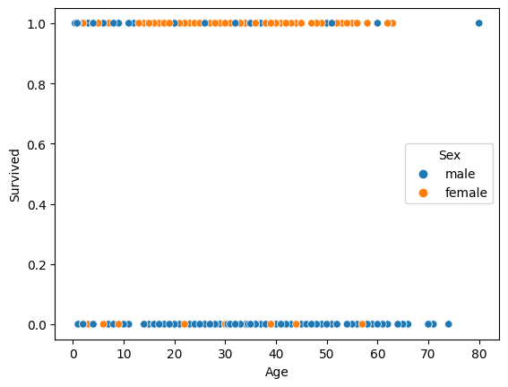
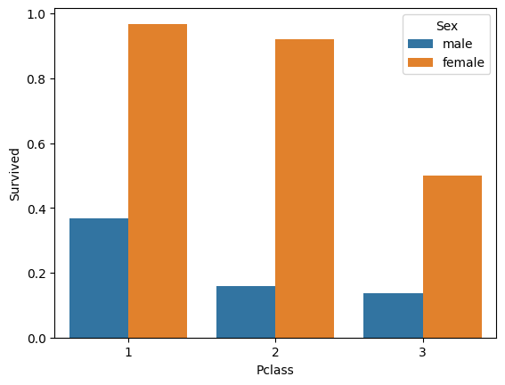
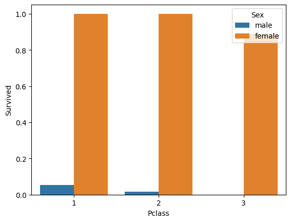

# Titanic Machine Learning Introduction
The following notebook walks through basic EDA and then deploys a machine learning model to correctly determine who survived the Titanic disaster. 

## Requirements
pandas,
matplotlib,
seaborn,
jupyter,
ydataprofiling,

## EDA
See notebook for specific code. Some variables actually correlated: sex, survived were the strongest, however other variables including Pclass also held some value. Their graph is image.png.

Report from ydataprofiling tool is [ydata profile report](report.html)

## Model 
Random Forest Classfier: n_estimators = 100, max depth = 5, random_state = 1

for results see: model_output_test.csv

